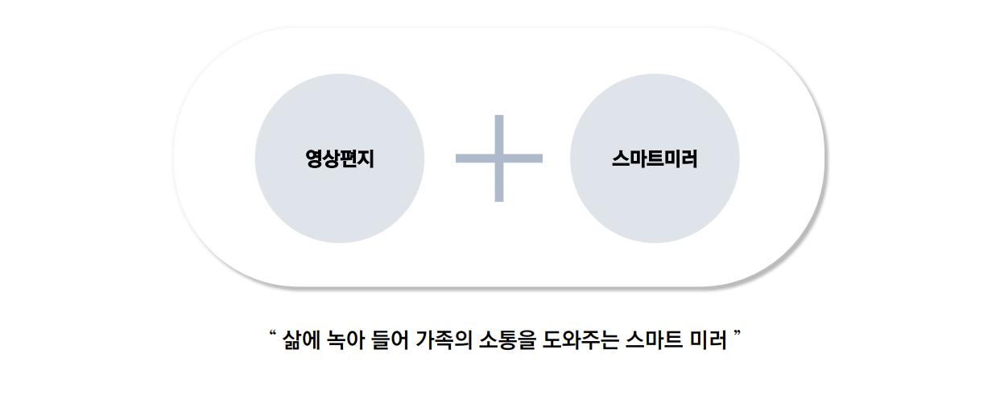
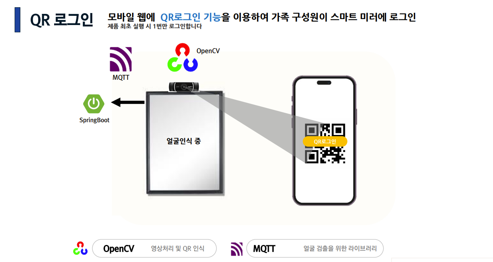
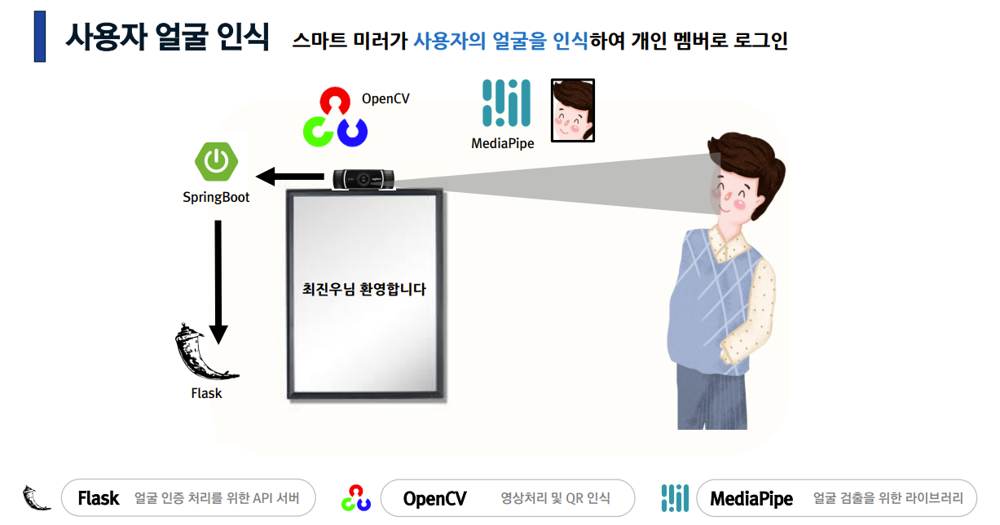
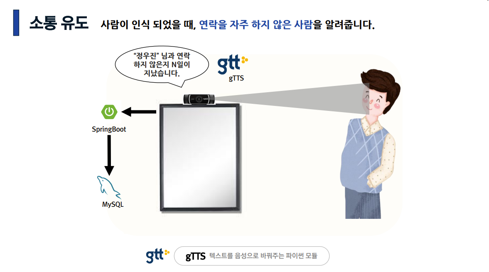

## 💌 famil_link : 물보다 진한 우리의 연➰결을 위해

### 🎦 소개 영상 

FAMIL_LINK 프로젝트
[](https://youtu.be/d2Xw3gKlAFk)
---

### 🎦 프로젝트 진행 기간

2023.01.03 ~ 2023.02.17 (진행일 : 45일)

---

### 🎦 배경


여러분은 가족들과 얼마나 대화하고 있으신가요? <br/>
한 설문조사에 따르면 55.7%의 사람이 가족과 하루에 30분 미만 대화를 나누는 것으로 나타났습니다. 16시간을 깨어있다고 가정 할 때 하루 중 단 3%에 해당하는 시간. 우리 모두에게 가족이란, 무엇보다 소중한 존재임에도 불구하고 우리가 보내는 시간 중 3%라는 극히 일부의 시간만 함께 보내고 있는 것입니다. 우리의 문제 의식은 바로 여기서 출발했습니다. <br>
<br>
__'소통부재'__<br/>
_현재 우리는 가족의 안보를 묻거나 얼굴 한 번 보기 힘든 사회에 살고 있다._


---

### 🎦 개요





---

### 🎦 SMART MIRROR 주요 기능

#### ⬛ QR코드 로그인 : 스마트미러 최초 구동시 QR코드로 가족 계정 로그인
<br>
김싸피는 가족 간 소통을 기대하며 스마트 미러를 구매했습니다. 김싸피가 제일 처음 스마트 미러를 구동하고 하게 되는 행동이 무엇일까요? 바로 로그인입니다. QR로그인 기능은 구매자가 제일 처음에 어떻게 본인임을 인식시킬 수 있을까? 라는 고민에서 출발했습니다. 스마트 미러는 구매 후 집안에 두고 이용하는 물건입니다. 따라서 최초 구매 시 한 번만 로그인 과정을 거치면 되기 때문에 로그인 과정을 최대한 간소화해야 한다고 생각하여 QR 로그인 기능을 구현하였습니다.
<br>


---

#### ⬛ 안면 인식 로그인 : 가족계정 로그인 후 멤버 인식

<br>
패밀링크는 개인별로 영상편지를 주고 받는 것, 소통을 유도하는 것이 핵심인 서비스입니다. 따라서 가족 계정으로 로그인 한 멤버를 구분하여 맞춤화된 서비스를 줄 필요가 있었습니다. 이미 많은 사람들이 익숙한 방법일 텐데요, 바로 '넷플릭스'의 사용자 경험입니다. 넷플릭스는 프로필을 누르면 바로 멤버 로그인이 되거나, 비밀번호를 통해 각자 계정을 보호하는 방식을 취하고 있습니다. 패밀링크는 개인에게 온 영상편지 확인이 핵심 서비스이기 때문에 좀 더 확실한 본인인증이 필요하다고 생각했고, 그 결과 안면인식 기능을 통해 개별 멤버 로그인 하는 방법을 고안하였습니다.
<br>



---

#### ⬛ 소통유도
<br>
다른 영상 전송 서비스가 아닌 패밀링크에 유저가 모일 수 있게 특별한 차별점이 필요했습니다. 그리고 그 차별점이 '소통 부재'라는 문제를 해결하는 핵심과 맞닿아 있어야 한다고 생각했습니다. 고민 끝에 나온 기능이 바로 '소통유도' 기능입니다. 데이터베이스에 기록된 개인별 영상편지 전송 날짜 및 일정을 가져와 TTS를 활용하여 소통 유도를 할 수 있게 구현하였습니다.
<br>


---

#### ⬛ 음성 인식 기반 영상편지 송수신
<br>
스크린 기반 IoT 기기의 가장 큰 문제점이 무엇일까요? 바로 고연령, 혹은 저연령층이 사용하기 어렵다는 것입니다. 패밀링크는 가족 구성원 간의 소통을 돕고 유대감을 향상시키자는 목표를 가지고 고안되었기 때문에, 가족 구성원의 연령에 상관 없이 기기를 사용할 수 있도록 만들었습니다. 그 과정에서 구현한 기술이 바로 음성인식 입니다. "녹화"라는 단어를 말한 후, 편지를 보내고자 하는 가족의 이름을 말하면 영상편지 녹화가 시작됩니다. 수신의 경우 사용자의 얼굴 인식이 끝나면 최신 5개를 바로 자동재생 할 수 있게 제작하였습니다.
<br>


---


### ✅ 사용한 기술 스택 및 시스템 구성도


---

### ✅ 프로젝트 파일 구조도


<details>
    <summary>✨ 백엔드 </summary>


```
📦BE
 ┣ 📂Flask
 ┃ ┣ 📂temp
 ┃ ┃ ┣ 📜labels.txt
 ┃ ┃ ┗ 📜model.h5
 ┃ ┣ 📂__pycache__
 ┃ ┃ ┗ 📜main.cpython-310.pyc
 ┃ ┣ 📜.gitignore
 ┃ ┣ 📜app.py
 ┃ ┣ 📜Dockerfile
 ┃ ┣ 📜face_detection_test.py
 ┃ ┣ 📜Jenkinsfile
 ┃ ┣ 📜main.py
 ┃ ┗ 📜test.jpg
 ┣ 📂Spring
 ┃ ┣ 📂src
 ┃ ┃ ┣ 📂main
 ┃ ┃ ┃ ┣ 📂java
 ┃ ┃ ┃ ┃ ┗ 📂com
 ┃ ┃ ┃ ┃ ┃ ┗ 📂famillink
 ┃ ┃ ┃ ┃ ┃ ┃ ┣ 📂annotation
 ┃ ┃ ┃ ┃ ┃ ┃ ┃ ┗ 📜ValidationGroups.java
 ┃ ┃ ┃ ┃ ┃ ┃ ┣ 📂config
 ┃ ┃ ┃ ┃ ┃ ┃ ┃ ┣ 📂security
 ┃ ┃ ┃ ┃ ┃ ┃ ┃ ┃ ┣ 📜CustomAccessDeniedHandler.java
 ┃ ┃ ┃ ┃ ┃ ┃ ┃ ┃ ┣ 📜CustomAuthenticationEntryPoint.java
 ┃ ┃ ┃ ┃ ┃ ┃ ┃ ┃ ┣ 📜JwtFilter.java
 ┃ ┃ ┃ ┃ ┃ ┃ ┃ ┃ ┗ 📜SecurityConfig.java
 ┃ ┃ ┃ ┃ ┃ ┃ ┃ ┣ 📜GlobalExceptionHandler.java
 ┃ ┃ ┃ ┃ ┃ ┃ ┃ ┣ 📜SwaggerConfiguration.java
 ┃ ┃ ┃ ┃ ┃ ┃ ┃ ┗ 📜WebConfiguration.java
 ┃ ┃ ┃ ┃ ┃ ┃ ┣ 📂controller
 ┃ ┃ ┃ ┃ ┃ ┃ ┃ ┣ 📜AccountController.java
 ┃ ┃ ┃ ┃ ┃ ┃ ┃ ┣ 📜FlaskController.java
 ┃ ┃ ┃ ┃ ┃ ┃ ┃ ┣ 📜MemberController.java
 ┃ ┃ ┃ ┃ ┃ ┃ ┃ ┣ 📜MovieController.java
 ┃ ┃ ┃ ┃ ┃ ┃ ┃ ┣ 📜PhotoController.java
 ┃ ┃ ┃ ┃ ┃ ┃ ┃ ┣ 📜ScheduleController.java
 ┃ ┃ ┃ ┃ ┃ ┃ ┃ ┣ 📜SseController.java
 ┃ ┃ ┃ ┃ ┃ ┃ ┃ ┣ 📜TestController.java
 ┃ ┃ ┃ ┃ ┃ ┃ ┃ ┗ 📜TodoController.java
 ┃ ┃ ┃ ┃ ┃ ┃ ┣ 📂exception
 ┃ ┃ ┃ ┃ ┃ ┃ ┃ ┣ 📜BaseException.java
 ┃ ┃ ┃ ┃ ┃ ┃ ┃ ┗ 📜ErrorMessage.java
 ┃ ┃ ┃ ┃ ┃ ┃ ┣ 📂model
 ┃ ┃ ┃ ┃ ┃ ┃ ┃ ┣ 📂domain
 ┃ ┃ ┃ ┃ ┃ ┃ ┃ ┃ ┣ 📂param
 ┃ ┃ ┃ ┃ ┃ ┃ ┃ ┃ ┃ ┣ 📜ImageDTO.java
 ┃ ┃ ┃ ┃ ┃ ┃ ┃ ┃ ┃ ┣ 📜MovieDTO.java
 ┃ ┃ ┃ ┃ ┃ ┃ ┃ ┃ ┃ ┣ 📜MovieOccur.java
 ┃ ┃ ┃ ┃ ┃ ┃ ┃ ┃ ┃ ┣ 📜MovieSenderDTO.java
 ┃ ┃ ┃ ┃ ┃ ┃ ┃ ┃ ┃ ┗ 📜PhotoSenderDTO.java
 ┃ ┃ ┃ ┃ ┃ ┃ ┃ ┃ ┗ 📂user
 ┃ ┃ ┃ ┃ ┃ ┃ ┃ ┃ ┃ ┣ 📜Account.java
 ┃ ┃ ┃ ┃ ┃ ┃ ┃ ┃ ┃ ┣ 📜Member.java
 ┃ ┃ ┃ ┃ ┃ ┃ ┃ ┃ ┃ ┣ 📜Member_Login.java
 ┃ ┃ ┃ ┃ ┃ ┃ ┃ ┃ ┃ ┣ 📜Schedule.java
 ┃ ┃ ┃ ┃ ┃ ┃ ┃ ┃ ┃ ┗ 📜Todo.java
 ┃ ┃ ┃ ┃ ┃ ┃ ┃ ┣ 📂mapper
 ┃ ┃ ┃ ┃ ┃ ┃ ┃ ┃ ┣ 📜AccountMapper.java
 ┃ ┃ ┃ ┃ ┃ ┃ ┃ ┃ ┣ 📜FlaskMapper.java
 ┃ ┃ ┃ ┃ ┃ ┃ ┃ ┃ ┣ 📜MemberMapper.java
 ┃ ┃ ┃ ┃ ┃ ┃ ┃ ┃ ┣ 📜MovieMapper.java
 ┃ ┃ ┃ ┃ ┃ ┃ ┃ ┃ ┣ 📜ScheduleMapper.java
 ┃ ┃ ┃ ┃ ┃ ┃ ┃ ┃ ┗ 📜TodoMapper.java
 ┃ ┃ ┃ ┃ ┃ ┃ ┃ ┗ 📂service
 ┃ ┃ ┃ ┃ ┃ ┃ ┃ ┃ ┣ 📜AccountService.java
 ┃ ┃ ┃ ┃ ┃ ┃ ┃ ┃ ┣ 📜AccountServiceImpl.java
 ┃ ┃ ┃ ┃ ┃ ┃ ┃ ┃ ┣ 📜CustomUserDetailsService.java
 ┃ ┃ ┃ ┃ ┃ ┃ ┃ ┃ ┣ 📜EmitterService.java
 ┃ ┃ ┃ ┃ ┃ ┃ ┃ ┃ ┣ 📜EmitterServiceImpl.java
 ┃ ┃ ┃ ┃ ┃ ┃ ┃ ┃ ┣ 📜FaceDetection.java
 ┃ ┃ ┃ ┃ ┃ ┃ ┃ ┃ ┣ 📜FaceDetectionImpl.java
 ┃ ┃ ┃ ┃ ┃ ┃ ┃ ┃ ┣ 📜FileService.java
 ┃ ┃ ┃ ┃ ┃ ┃ ┃ ┃ ┣ 📜FileServiceImpl.java
 ┃ ┃ ┃ ┃ ┃ ┃ ┃ ┃ ┣ 📜FlaskFileService.java
 ┃ ┃ ┃ ┃ ┃ ┃ ┃ ┃ ┣ 📜FlaskFileServiceImpl.java
 ┃ ┃ ┃ ┃ ┃ ┃ ┃ ┃ ┣ 📜FlaskService.java
 ┃ ┃ ┃ ┃ ┃ ┃ ┃ ┃ ┣ 📜FlaskServiceImpl.java
 ┃ ┃ ┃ ┃ ┃ ┃ ┃ ┃ ┣ 📜MemberService.java
 ┃ ┃ ┃ ┃ ┃ ┃ ┃ ┃ ┣ 📜MemberServiceImpl.java
 ┃ ┃ ┃ ┃ ┃ ┃ ┃ ┃ ┣ 📜MovieService.java
 ┃ ┃ ┃ ┃ ┃ ┃ ┃ ┃ ┣ 📜MovieServiceImpl.java
 ┃ ┃ ┃ ┃ ┃ ┃ ┃ ┃ ┣ 📜PhotoFileService.java
 ┃ ┃ ┃ ┃ ┃ ┃ ┃ ┃ ┣ 📜PhotoFileServiceImpl.java
 ┃ ┃ ┃ ┃ ┃ ┃ ┃ ┃ ┣ 📜PhotoService.java
 ┃ ┃ ┃ ┃ ┃ ┃ ┃ ┃ ┣ 📜PhotoServiceImpl.java
 ┃ ┃ ┃ ┃ ┃ ┃ ┃ ┃ ┣ 📜ScheduleService.java
 ┃ ┃ ┃ ┃ ┃ ┃ ┃ ┃ ┣ 📜ScheduleServiceImpl.java
 ┃ ┃ ┃ ┃ ┃ ┃ ┃ ┃ ┣ 📜SseService.java
 ┃ ┃ ┃ ┃ ┃ ┃ ┃ ┃ ┣ 📜SseServiceImpl.java
 ┃ ┃ ┃ ┃ ┃ ┃ ┃ ┃ ┣ 📜TestService.java
 ┃ ┃ ┃ ┃ ┃ ┃ ┃ ┃ ┣ 📜TestServiceImpl.java
 ┃ ┃ ┃ ┃ ┃ ┃ ┃ ┃ ┣ 📜TodoService.java
 ┃ ┃ ┃ ┃ ┃ ┃ ┃ ┃ ┣ 📜TodoServiceImpl.java
 ┃ ┃ ┃ ┃ ┃ ┃ ┃ ┃ ┣ 📜ToFlask.java
 ┃ ┃ ┃ ┃ ┃ ┃ ┃ ┃ ┗ 📜ToFlaskImpl.java
 ┃ ┃ ┃ ┃ ┃ ┃ ┣ 📂util
 ┃ ┃ ┃ ┃ ┃ ┃ ┃ ┣ 📜EmailHandler.java
 ┃ ┃ ┃ ┃ ┃ ┃ ┃ ┗ 📜JwtTokenProvider.java
 ┃ ┃ ┃ ┃ ┃ ┃ ┗ 📜FamilLinkApplication.java
 ┃ ┃ ┃ ┗ 📂resources
 ┃ ┃ ┃ ┃ ┣ 📂mapper
 ┃ ┃ ┃ ┃ ┃ ┣ 📜account.xml
 ┃ ┃ ┃ ┃ ┃ ┣ 📜member.xml
 ┃ ┃ ┃ ┃ ┃ ┣ 📜movie.xml
 ┃ ┃ ┃ ┃ ┃ ┣ 📜schedule.xml
 ┃ ┃ ┃ ┃ ┃ ┗ 📜todo.xml
 ┃ ┃ ┃ ┃ ┗ 📂schema
 ┃ ┃ ┃ ┃ ┃ ┗ 📜script.sql
 ┃ ┃ ┗ 📂test
 ┃ ┃ ┃ ┣ 📂image
 ┃ ┃ ┃ ┃ ┣ 📜bag.jpg
 ┃ ┃ ┃ ┃ ┣ 📜cjw.jpg
 ┃ ┃ ┃ ┃ ┣ 📜docker.jpg
 ┃ ┃ ┃ ┃ ┗ 📜none.jpg
 ┃ ┃ ┃ ┗ 📂java
 ┃ ┃ ┃ ┃ ┗ 📂com
 ┃ ┃ ┃ ┃ ┃ ┗ 📂famillink
 ┃ ┃ ┃ ┃ ┃ ┃ ┣ 📂model
 ┃ ┃ ┃ ┃ ┃ ┃ ┃ ┗ 📂service
 ┃ ┃ ┃ ┃ ┃ ┃ ┃ ┃ ┣ 📜EmitterServiceImplTest.java
 ┃ ┃ ┃ ┃ ┃ ┃ ┃ ┃ ┗ 📜SseServiceImplTest.java
 ┃ ┃ ┃ ┃ ┃ ┃ ┗ 📜AllInfoProjectApplicationTests.java
 ┃ ┣ 📜.gitignore
 ┃ ┣ 📜Dockerfile
 ┃ ┣ 📜Jenkinsfile
 ┃ ┣ 📜mvnw
 ┃ ┣ 📜mvnw.cmd
 ┃ ┗ 📜pom.xml
 ┗ 📂Test
 ┃ ┣ 📜.gitignore
 ┃ ┣ 📜bag.jpg
 ┃ ┣ 📜cjw.jpg
 ┃ ┣ 📜docker.jpg
 ┃ ┣ 📜main.py
 ┃ ┗ 📜none.jpg
```

</details>

<details>
    <summary>✨ 프론트엔드 </summary>


```
📦FE
 ┣ 📂mobile
 ┃ ┣ 📂public
 ┃ ┃ ┣ 📂images
 ┃ ┃ ┃ ┗ 📜다운로드.jpg
 ┃ ┃ ┣ 📜favicon.ico
 ┃ ┃ ┣ 📜index.html
 ┃ ┃ ┣ 📜logo192.png
 ┃ ┃ ┣ 📜logo512.png
 ┃ ┃ ┣ 📜manifest.json
 ┃ ┃ ┗ 📜robots.txt
 ┃ ┣ 📂src
 ┃ ┃ ┣ 📂components
 ┃ ┃ ┃ ┣ 📂auth
 ┃ ┃ ┃ ┃ ┣ 📜AuthForm.js
 ┃ ┃ ┃ ┃ ┣ 📜AuthLayout.js
 ┃ ┃ ┃ ┃ ┗ 📜AuthTemplate.js
 ┃ ┃ ┃ ┣ 📂common
 ┃ ┃ ┃ ┃ ┣ 📜Button.js
 ┃ ┃ ┃ ┃ ┗ 📜Responsive.js
 ┃ ┃ ┃ ┣ 📂images
 ┃ ┃ ┃ ┃ ┣ 📜1.PNG
 ┃ ┃ ┃ ┃ ┣ 📜2.PNG
 ┃ ┃ ┃ ┃ ┣ 📜3.PNG
 ┃ ┃ ┃ ┃ ┣ 📜profile.png
 ┃ ┃ ┃ ┃ ┗ 📜다운로드.jpg
 ┃ ┃ ┃ ┣ 📂navbar
 ┃ ┃ ┃ ┃ ┣ 📂about
 ┃ ┃ ┃ ┃ ┃ ┣ 📜about.css
 ┃ ┃ ┃ ┃ ┃ ┣ 📜About.jsx
 ┃ ┃ ┃ ┃ ┃ ┗ 📜AboutBox.jsx
 ┃ ┃ ┃ ┃ ┣ 📂blog
 ┃ ┃ ┃ ┃ ┃ ┣ 📜blog.css
 ┃ ┃ ┃ ┃ ┃ ┗ 📜Blog.jsx
 ┃ ┃ ┃ ┃ ┣ 📂home
 ┃ ┃ ┃ ┃ ┃ ┣ 📜HeaderSocials.jsx
 ┃ ┃ ┃ ┃ ┃ ┣ 📜home.css
 ┃ ┃ ┃ ┃ ┃ ┣ 📜Home.jsx
 ┃ ┃ ┃ ┃ ┃ ┗ 📜ScrollDown.jsx
 ┃ ┃ ┃ ┃ ┣ 📂portfolio
 ┃ ┃ ┃ ┃ ┃ ┣ 📜portfolio.css
 ┃ ┃ ┃ ┃ ┃ ┗ 📜Portfolio.jsx
 ┃ ┃ ┃ ┃ ┣ 📂resume
 ┃ ┃ ┃ ┃ ┃ ┣ 📜resume.css
 ┃ ┃ ┃ ┃ ┃ ┗ 📜Resume.jsx
 ┃ ┃ ┃ ┃ ┣ 📂services
 ┃ ┃ ┃ ┃ ┃ ┣ 📜service.css
 ┃ ┃ ┃ ┃ ┃ ┗ 📜Services.jsx
 ┃ ┃ ┃ ┃ ┣ 📂sidebar
 ┃ ┃ ┃ ┃ ┃ ┣ 📜sidebar.css
 ┃ ┃ ┃ ┃ ┃ ┗ 📜Sidebar.jsx
 ┃ ┃ ┃ ┃ ┣ 📂testmonials
 ┃ ┃ ┃ ┃ ┃ ┣ 📜testimonials.css
 ┃ ┃ ┃ ┃ ┃ ┗ 📜Testimonials.jsx
 ┃ ┃ ┃ ┃ ┣ 📜navbar.css
 ┃ ┃ ┃ ┃ ┗ 📜Navbar.js
 ┃ ┃ ┃ ┣ 📂todo
 ┃ ┃ ┃ ┃ ┣ 📂service
 ┃ ┃ ┃ ┃ ┃ ┣ 📜ApiService.js
 ┃ ┃ ┃ ┃ ┃ ┗ 📜client.js
 ┃ ┃ ┃ ┃ ┣ 📜ApiBaseUrl.js
 ┃ ┃ ┃ ┃ ┣ 📜todo.css
 ┃ ┃ ┃ ┃ ┣ 📜TodoInput.jsx
 ┃ ┃ ┃ ┃ ┣ 📜TodoList.jsx
 ┃ ┃ ┃ ┃ ┗ 📜TodoListPage.jsx
 ┃ ┃ ┃ ┣ 📜Input.js
 ┃ ┃ ┃ ┣ 📜Logo.js
 ┃ ┃ ┃ ┗ 📜Profile.js
 ┃ ┃ ┣ 📂containers
 ┃ ┃ ┃ ┗ 📂auth
 ┃ ┃ ┃ ┃ ┣ 📜LoginForm.js
 ┃ ┃ ┃ ┃ ┗ 📜SignupForm.js
 ┃ ┃ ┣ 📂lib
 ┃ ┃ ┃ ┣ 📂api
 ┃ ┃ ┃ ┃ ┣ 📜auth.js
 ┃ ┃ ┃ ┃ ┣ 📜family.js
 ┃ ┃ ┃ ┃ ┗ 📜users.js
 ┃ ┃ ┃ ┣ 📂styles
 ┃ ┃ ┃ ┃ ┗ 📜palette.js
 ┃ ┃ ┃ ┗ 📜createRequestSaga.js
 ┃ ┃ ┣ 📂modules
 ┃ ┃ ┃ ┣ 📜auth.js
 ┃ ┃ ┃ ┣ 📜index.js
 ┃ ┃ ┃ ┣ 📜loading.js
 ┃ ┃ ┃ ┣ 📜loginstatus.js
 ┃ ┃ ┃ ┣ 📜token.js
 ┃ ┃ ┃ ┗ 📜user.js
 ┃ ┃ ┣ 📂pages
 ┃ ┃ ┃ ┣ 📜calendar.css
 ┃ ┃ ┃ ┣ 📜Calendars.js
 ┃ ┃ ┃ ┣ 📜FamilyMember.js
 ┃ ┃ ┃ ┣ 📜FamilyMemberRegister.css
 ┃ ┃ ┃ ┣ 📜FamilyMemberRegister.js
 ┃ ┃ ┃ ┣ 📜Login.css
 ┃ ┃ ┃ ┣ 📜Login.js
 ┃ ┃ ┃ ┣ 📜PostListPage.js
 ┃ ┃ ┃ ┣ 📜Record.js
 ┃ ┃ ┃ ┣ 📜SignUp.js
 ┃ ┃ ┃ ┣ 📜SignUpSuccess.js
 ┃ ┃ ┃ ┗ 📜Todo.js
 ┃ ┃ ┣ 📂store
 ┃ ┃ ┃ ┣ 📜Auth.js
 ┃ ┃ ┃ ┗ 📜index.js
 ┃ ┃ ┣ 📜App.css
 ┃ ┃ ┣ 📜App.js
 ┃ ┃ ┣ 📜App.test.js
 ┃ ┃ ┣ 📜index.css
 ┃ ┃ ┣ 📜index.js
 ┃ ┃ ┣ 📜reportWebVitals.js
 ┃ ┃ ┗ 📜setupTests.js
 ┃ ┣ 📜.gitignore
 ┃ ┣ 📜Dockerfile
 ┃ ┣ 📜package-lock.json
 ┃ ┣ 📜package.json
 ┃ ┣ 📜README.md
 ┃ ┗ 📜yarn.lock
 ┣ 📜.gitignore
 ┗ 📜README.md
```


</details>    


<details>
    <summary>✨ RM </summary>
    
 ```
📦RM
 ┣ 📂MW
 ┃ ┣ 📂mirrorweb
 ┃ ┃ ┣ 📂public
 ┃ ┃ ┃ ┣ 📜favicon.ico
 ┃ ┃ ┃ ┣ 📜index.html
 ┃ ┃ ┃ ┣ 📜logo192.png
 ┃ ┃ ┃ ┣ 📜logo512.png
 ┃ ┃ ┃ ┣ 📜manifest.json
 ┃ ┃ ┃ ┗ 📜robots.txt
 ┃ ┃ ┣ 📂src
 ┃ ┃ ┃ ┣ 📂components
 ┃ ┃ ┃ ┃ ┣ 📜Calendar.js
 ┃ ┃ ┃ ┃ ┣ 📜Caption.css
 ┃ ┃ ┃ ┃ ┣ 📜Caption.js
 ┃ ┃ ┃ ┃ ┣ 📜Clock.css
 ┃ ┃ ┃ ┃ ┣ 📜Clock.jsx
 ┃ ┃ ┃ ┃ ┣ 📜Location.js
 ┃ ┃ ┃ ┃ ┣ 📜MQTT.js
 ┃ ┃ ┃ ┃ ┣ 📜SSE.js
 ┃ ┃ ┃ ┃ ┣ 📜STT.js
 ┃ ┃ ┃ ┃ ┣ 📜Timer.js
 ┃ ┃ ┃ ┃ ┣ 📜Todo.js
 ┃ ┃ ┃ ┃ ┣ 📜TTS.js
 ┃ ┃ ┃ ┃ ┣ 📜Weather.css
 ┃ ┃ ┃ ┃ ┣ 📜Weather.js
 ┃ ┃ ┃ ┃ ┗ 📜WeatherHookTest.js
 ┃ ┃ ┃ ┣ 📂constants
 ┃ ┃ ┃ ┃ ┗ 📜geolocationOptions.js
 ┃ ┃ ┃ ┣ 📂fonts
 ┃ ┃ ┃ ┃ ┣ 📜LINESeedKR-Rg.ttf
 ┃ ┃ ┃ ┃ ┣ 📜LINESeedSans_Rg.ttf
 ┃ ┃ ┃ ┃ ┣ 📜강원교육모두 Bold.ttf
 ┃ ┃ ┃ ┃ ┣ 📜강원교육모두 Light.ttf
 ┃ ┃ ┃ ┃ ┗ 📜강원교육튼튼.ttf
 ┃ ┃ ┃ ┣ 📂hooks
 ┃ ┃ ┃ ┃ ┗ 📜useCurrentLocation.js
 ┃ ┃ ┃ ┣ 📂modules
 ┃ ┃ ┃ ┃ ┣ 📜index.js
 ┃ ┃ ┃ ┃ ┗ 📜valid.js
 ┃ ┃ ┃ ┣ 📂pages
 ┃ ┃ ┃ ┃ ┣ 📜Main.css
 ┃ ┃ ┃ ┃ ┣ 📜Main.js
 ┃ ┃ ┃ ┃ ┣ 📜PlayVideo.css
 ┃ ┃ ┃ ┃ ┣ 📜PlayVideo.js
 ┃ ┃ ┃ ┃ ┣ 📜QR.js
 ┃ ┃ ┃ ┃ ┗ 📜Record.js
 ┃ ┃ ┃ ┣ 📜App.css
 ┃ ┃ ┃ ┣ 📜App.jsx
 ┃ ┃ ┃ ┣ 📜App.test.js
 ┃ ┃ ┃ ┣ 📜index.css
 ┃ ┃ ┃ ┣ 📜index.js
 ┃ ┃ ┃ ┣ 📜logo.svg
 ┃ ┃ ┃ ┣ 📜reportWebVitals.js
 ┃ ┃ ┃ ┗ 📜setupTests.js
 ┃ ┃ ┣ 📜.gitignore
 ┃ ┃ ┣ 📜package-lock.json
 ┃ ┃ ┣ 📜package.json
 ┃ ┃ ┣ 📜README.md
 ┃ ┃ ┗ 📜yarn.lock
 ┃ ┣ 📜.gitignore
 ┃ ┗ 📜package-lock.json
 ┣ 📂RS
 ┃ ┣ 📂.idea
 ┃ ┃ ┣ 📂inspectionProfiles
 ┃ ┃ ┃ ┗ 📜profiles_settings.xml
 ┃ ┃ ┣ 📜.gitignore
 ┃ ┃ ┣ 📜misc.xml
 ┃ ┃ ┣ 📜modules.xml
 ┃ ┃ ┣ 📜RS.iml
 ┃ ┃ ┣ 📜runConfigurations.xml
 ┃ ┃ ┗ 📜vcs.xml
 ┃ ┣ 📜.gitignore
 ┃ ┣ 📜face_cognize.py
 ┃ ┣ 📜face_image_save.py
 ┃ ┣ 📜labels.txt
 ┃ ┣ 📜mqtt_camera.py
 ┃ ┣ 📜mqtt_congnize.py
 ┃ ┣ 📜mqtt_speech.py
 ┃ ┣ 📜mqtt_tts.py
 ┃ ┣ 📜recog_test.py
 ┃ ┣ 📜record.mp4
 ┃ ┗ 📜test.py
 ┗ 📜README.md
```
    
</details>  


---


### ✅ 협업툴

 <br>
 <br>
 <br>
 <br>
 <br>
 <br>


---


### ✅ 협업 환경

#### GitLab
- 프로젝트 시작 전 커밋 컨벤션을 정한 후 협업 진행 
- 프론트엔드, 백엔드, IoT로 나누어 협업

#### Jira
- Story Point를 1, 3, 5, 8로 정하고 세분화하여 작업을 효율적으로 진행하기 위해 노력
- Epic : 프론트엔드, 백엔드, IoT 구분
- Story : 구현 기능 구분

#### Mattermost, KakaoTalk
- 팀단톡방을 만들어 자료 공유 및 현황 공유 
    - 주 사용 프로그램 : Mattermost
    - 100MB 이상의 자료 공유 : KakaoTalk
- 확인 시 흔적(스티커, 답변 등) 남기기를 그라운드룰로 정하여 소통

#### Notion
- 문서화가 필요한 자료 기록
- 간트차트 작성
- 회의록 작성
- 참고자료 업로드
- 기능구현 현황 파악

#### Google Meet, WebEx
- 격리 등의 이슈가 있을 경우 화상채팅으로 진행

---


### ✅ 프로젝트 결과물
- [중간 발표 자료](https://github.com/choidahye99/javachip-famillink/tree/main/Present/%EA%B8%B0%ED%9A%8D%20%EC%A4%91%EA%B0%84%20%EB%B0%9C%ED%91%9C)
- [최종 발표 자료](https://github.com/choidahye99/javachip-famillink/tree/main/Present/%EC%B5%9C%EC%A2%85%20%EB%B0%9C%ED%91%9C)
---


