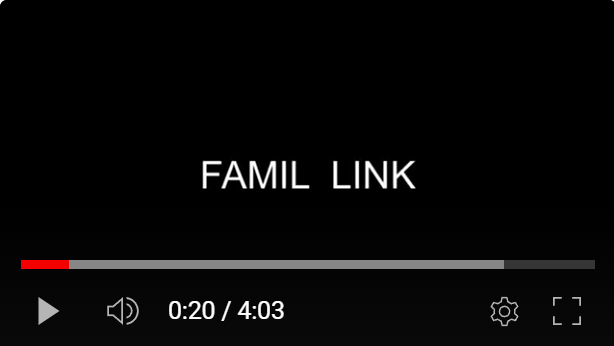

## 💌 famil_link : 물보다 진한 우리의 연➰결을 위해

### 🎦 소개 영상 

FAMIL_LINK 프로젝트
[](https://youtu.be/d2Xw3gKlAFk)
---

### 🎦 프로젝트 진행 기간

2023.01.03 ~ 2023.02.17 (진행일 : 45일)

---

### 🎦 배경


여러분은 가족들과 얼마나 대화하고 있으신가요? <br/>
한 설문조사에 따르면 55.7%의 사람이 가족과 하루에 30분 미만 대화를 나누는 것으로 나타났습니다. 16시간을 깨어있다고 가정 할 때 하루 중 단 3%에 해당하는 시간. 우리 모두에게 가족이란, 무엇보다 소중한 존재임에도 불구하고 우리가 보내는 시간 중 3%라는 극히 일부의 시간만 함께 보내고 있는 것입니다. 우리의 문제 의식은 바로 여기서 출발했습니다. <br>
<br>
__'소통부재'__<br/>
_현재 우리는 가족의 안보를 묻거나 얼굴 한 번 보기 힘든 사회에 살고 있다._


---

### 🎦 개요


[개요](img/프로젝트개요.png)
__삶에 녹아들어 가족들의 소통을 도와주는 스마트미러👪__


---

### 🎦 주요 기능
---

### ✅ 사용한 기술 스택
---

### ✅ 프로젝트 파일 구조도


<details>
    <summary>✨ 백엔드 </summary>


```
📦BE
 ┣ 📂Flask
 ┃ ┣ 📂temp
 ┃ ┃ ┣ 📜labels.txt
 ┃ ┃ ┗ 📜model.h5
 ┃ ┣ 📂__pycache__
 ┃ ┃ ┗ 📜main.cpython-310.pyc
 ┃ ┣ 📜.gitignore
 ┃ ┣ 📜app.py
 ┃ ┣ 📜Dockerfile
 ┃ ┣ 📜face_detection_test.py
 ┃ ┣ 📜Jenkinsfile
 ┃ ┣ 📜main.py
 ┃ ┗ 📜test.jpg
 ┣ 📂Spring
 ┃ ┣ 📂src
 ┃ ┃ ┣ 📂main
 ┃ ┃ ┃ ┣ 📂java
 ┃ ┃ ┃ ┃ ┗ 📂com
 ┃ ┃ ┃ ┃ ┃ ┗ 📂famillink
 ┃ ┃ ┃ ┃ ┃ ┃ ┣ 📂annotation
 ┃ ┃ ┃ ┃ ┃ ┃ ┃ ┗ 📜ValidationGroups.java
 ┃ ┃ ┃ ┃ ┃ ┃ ┣ 📂config
 ┃ ┃ ┃ ┃ ┃ ┃ ┃ ┣ 📂security
 ┃ ┃ ┃ ┃ ┃ ┃ ┃ ┃ ┣ 📜CustomAccessDeniedHandler.java
 ┃ ┃ ┃ ┃ ┃ ┃ ┃ ┃ ┣ 📜CustomAuthenticationEntryPoint.java
 ┃ ┃ ┃ ┃ ┃ ┃ ┃ ┃ ┣ 📜JwtFilter.java
 ┃ ┃ ┃ ┃ ┃ ┃ ┃ ┃ ┗ 📜SecurityConfig.java
 ┃ ┃ ┃ ┃ ┃ ┃ ┃ ┣ 📜GlobalExceptionHandler.java
 ┃ ┃ ┃ ┃ ┃ ┃ ┃ ┣ 📜SwaggerConfiguration.java
 ┃ ┃ ┃ ┃ ┃ ┃ ┃ ┗ 📜WebConfiguration.java
 ┃ ┃ ┃ ┃ ┃ ┃ ┣ 📂controller
 ┃ ┃ ┃ ┃ ┃ ┃ ┃ ┣ 📜AccountController.java
 ┃ ┃ ┃ ┃ ┃ ┃ ┃ ┣ 📜FlaskController.java
 ┃ ┃ ┃ ┃ ┃ ┃ ┃ ┣ 📜MemberController.java
 ┃ ┃ ┃ ┃ ┃ ┃ ┃ ┣ 📜MovieController.java
 ┃ ┃ ┃ ┃ ┃ ┃ ┃ ┣ 📜PhotoController.java
 ┃ ┃ ┃ ┃ ┃ ┃ ┃ ┣ 📜ScheduleController.java
 ┃ ┃ ┃ ┃ ┃ ┃ ┃ ┣ 📜SseController.java
 ┃ ┃ ┃ ┃ ┃ ┃ ┃ ┣ 📜TestController.java
 ┃ ┃ ┃ ┃ ┃ ┃ ┃ ┗ 📜TodoController.java
 ┃ ┃ ┃ ┃ ┃ ┃ ┣ 📂exception
 ┃ ┃ ┃ ┃ ┃ ┃ ┃ ┣ 📜BaseException.java
 ┃ ┃ ┃ ┃ ┃ ┃ ┃ ┗ 📜ErrorMessage.java
 ┃ ┃ ┃ ┃ ┃ ┃ ┣ 📂model
 ┃ ┃ ┃ ┃ ┃ ┃ ┃ ┣ 📂domain
 ┃ ┃ ┃ ┃ ┃ ┃ ┃ ┃ ┣ 📂param
 ┃ ┃ ┃ ┃ ┃ ┃ ┃ ┃ ┃ ┣ 📜ImageDTO.java
 ┃ ┃ ┃ ┃ ┃ ┃ ┃ ┃ ┃ ┣ 📜MovieDTO.java
 ┃ ┃ ┃ ┃ ┃ ┃ ┃ ┃ ┃ ┣ 📜MovieOccur.java
 ┃ ┃ ┃ ┃ ┃ ┃ ┃ ┃ ┃ ┣ 📜MovieSenderDTO.java
 ┃ ┃ ┃ ┃ ┃ ┃ ┃ ┃ ┃ ┗ 📜PhotoSenderDTO.java
 ┃ ┃ ┃ ┃ ┃ ┃ ┃ ┃ ┗ 📂user
 ┃ ┃ ┃ ┃ ┃ ┃ ┃ ┃ ┃ ┣ 📜Account.java
 ┃ ┃ ┃ ┃ ┃ ┃ ┃ ┃ ┃ ┣ 📜Member.java
 ┃ ┃ ┃ ┃ ┃ ┃ ┃ ┃ ┃ ┣ 📜Member_Login.java
 ┃ ┃ ┃ ┃ ┃ ┃ ┃ ┃ ┃ ┣ 📜Schedule.java
 ┃ ┃ ┃ ┃ ┃ ┃ ┃ ┃ ┃ ┗ 📜Todo.java
 ┃ ┃ ┃ ┃ ┃ ┃ ┃ ┣ 📂mapper
 ┃ ┃ ┃ ┃ ┃ ┃ ┃ ┃ ┣ 📜AccountMapper.java
 ┃ ┃ ┃ ┃ ┃ ┃ ┃ ┃ ┣ 📜FlaskMapper.java
 ┃ ┃ ┃ ┃ ┃ ┃ ┃ ┃ ┣ 📜MemberMapper.java
 ┃ ┃ ┃ ┃ ┃ ┃ ┃ ┃ ┣ 📜MovieMapper.java
 ┃ ┃ ┃ ┃ ┃ ┃ ┃ ┃ ┣ 📜ScheduleMapper.java
 ┃ ┃ ┃ ┃ ┃ ┃ ┃ ┃ ┗ 📜TodoMapper.java
 ┃ ┃ ┃ ┃ ┃ ┃ ┃ ┗ 📂service
 ┃ ┃ ┃ ┃ ┃ ┃ ┃ ┃ ┣ 📜AccountService.java
 ┃ ┃ ┃ ┃ ┃ ┃ ┃ ┃ ┣ 📜AccountServiceImpl.java
 ┃ ┃ ┃ ┃ ┃ ┃ ┃ ┃ ┣ 📜CustomUserDetailsService.java
 ┃ ┃ ┃ ┃ ┃ ┃ ┃ ┃ ┣ 📜EmitterService.java
 ┃ ┃ ┃ ┃ ┃ ┃ ┃ ┃ ┣ 📜EmitterServiceImpl.java
 ┃ ┃ ┃ ┃ ┃ ┃ ┃ ┃ ┣ 📜FaceDetection.java
 ┃ ┃ ┃ ┃ ┃ ┃ ┃ ┃ ┣ 📜FaceDetectionImpl.java
 ┃ ┃ ┃ ┃ ┃ ┃ ┃ ┃ ┣ 📜FileService.java
 ┃ ┃ ┃ ┃ ┃ ┃ ┃ ┃ ┣ 📜FileServiceImpl.java
 ┃ ┃ ┃ ┃ ┃ ┃ ┃ ┃ ┣ 📜FlaskFileService.java
 ┃ ┃ ┃ ┃ ┃ ┃ ┃ ┃ ┣ 📜FlaskFileServiceImpl.java
 ┃ ┃ ┃ ┃ ┃ ┃ ┃ ┃ ┣ 📜FlaskService.java
 ┃ ┃ ┃ ┃ ┃ ┃ ┃ ┃ ┣ 📜FlaskServiceImpl.java
 ┃ ┃ ┃ ┃ ┃ ┃ ┃ ┃ ┣ 📜MemberService.java
 ┃ ┃ ┃ ┃ ┃ ┃ ┃ ┃ ┣ 📜MemberServiceImpl.java
 ┃ ┃ ┃ ┃ ┃ ┃ ┃ ┃ ┣ 📜MovieService.java
 ┃ ┃ ┃ ┃ ┃ ┃ ┃ ┃ ┣ 📜MovieServiceImpl.java
 ┃ ┃ ┃ ┃ ┃ ┃ ┃ ┃ ┣ 📜PhotoFileService.java
 ┃ ┃ ┃ ┃ ┃ ┃ ┃ ┃ ┣ 📜PhotoFileServiceImpl.java
 ┃ ┃ ┃ ┃ ┃ ┃ ┃ ┃ ┣ 📜PhotoService.java
 ┃ ┃ ┃ ┃ ┃ ┃ ┃ ┃ ┣ 📜PhotoServiceImpl.java
 ┃ ┃ ┃ ┃ ┃ ┃ ┃ ┃ ┣ 📜ScheduleService.java
 ┃ ┃ ┃ ┃ ┃ ┃ ┃ ┃ ┣ 📜ScheduleServiceImpl.java
 ┃ ┃ ┃ ┃ ┃ ┃ ┃ ┃ ┣ 📜SseService.java
 ┃ ┃ ┃ ┃ ┃ ┃ ┃ ┃ ┣ 📜SseServiceImpl.java
 ┃ ┃ ┃ ┃ ┃ ┃ ┃ ┃ ┣ 📜TestService.java
 ┃ ┃ ┃ ┃ ┃ ┃ ┃ ┃ ┣ 📜TestServiceImpl.java
 ┃ ┃ ┃ ┃ ┃ ┃ ┃ ┃ ┣ 📜TodoService.java
 ┃ ┃ ┃ ┃ ┃ ┃ ┃ ┃ ┣ 📜TodoServiceImpl.java
 ┃ ┃ ┃ ┃ ┃ ┃ ┃ ┃ ┣ 📜ToFlask.java
 ┃ ┃ ┃ ┃ ┃ ┃ ┃ ┃ ┗ 📜ToFlaskImpl.java
 ┃ ┃ ┃ ┃ ┃ ┃ ┣ 📂util
 ┃ ┃ ┃ ┃ ┃ ┃ ┃ ┣ 📜EmailHandler.java
 ┃ ┃ ┃ ┃ ┃ ┃ ┃ ┗ 📜JwtTokenProvider.java
 ┃ ┃ ┃ ┃ ┃ ┃ ┗ 📜FamilLinkApplication.java
 ┃ ┃ ┃ ┗ 📂resources
 ┃ ┃ ┃ ┃ ┣ 📂mapper
 ┃ ┃ ┃ ┃ ┃ ┣ 📜account.xml
 ┃ ┃ ┃ ┃ ┃ ┣ 📜member.xml
 ┃ ┃ ┃ ┃ ┃ ┣ 📜movie.xml
 ┃ ┃ ┃ ┃ ┃ ┣ 📜schedule.xml
 ┃ ┃ ┃ ┃ ┃ ┗ 📜todo.xml
 ┃ ┃ ┃ ┃ ┗ 📂schema
 ┃ ┃ ┃ ┃ ┃ ┗ 📜script.sql
 ┃ ┃ ┗ 📂test
 ┃ ┃ ┃ ┣ 📂image
 ┃ ┃ ┃ ┃ ┣ 📜bag.jpg
 ┃ ┃ ┃ ┃ ┣ 📜cjw.jpg
 ┃ ┃ ┃ ┃ ┣ 📜docker.jpg
 ┃ ┃ ┃ ┃ ┗ 📜none.jpg
 ┃ ┃ ┃ ┗ 📂java
 ┃ ┃ ┃ ┃ ┗ 📂com
 ┃ ┃ ┃ ┃ ┃ ┗ 📂famillink
 ┃ ┃ ┃ ┃ ┃ ┃ ┣ 📂model
 ┃ ┃ ┃ ┃ ┃ ┃ ┃ ┗ 📂service
 ┃ ┃ ┃ ┃ ┃ ┃ ┃ ┃ ┣ 📜EmitterServiceImplTest.java
 ┃ ┃ ┃ ┃ ┃ ┃ ┃ ┃ ┗ 📜SseServiceImplTest.java
 ┃ ┃ ┃ ┃ ┃ ┃ ┗ 📜AllInfoProjectApplicationTests.java
 ┃ ┣ 📜.gitignore
 ┃ ┣ 📜Dockerfile
 ┃ ┣ 📜Jenkinsfile
 ┃ ┣ 📜mvnw
 ┃ ┣ 📜mvnw.cmd
 ┃ ┗ 📜pom.xml
 ┗ 📂Test
 ┃ ┣ 📜.gitignore
 ┃ ┣ 📜bag.jpg
 ┃ ┣ 📜cjw.jpg
 ┃ ┣ 📜docker.jpg
 ┃ ┣ 📜main.py
 ┃ ┗ 📜none.jpg
```

</details>

<details>
    <summary>✨ 프론트엔드 </summary>


```
📦FE
 ┣ 📂mobile
 ┃ ┣ 📂public
 ┃ ┃ ┣ 📂images
 ┃ ┃ ┃ ┗ 📜다운로드.jpg
 ┃ ┃ ┣ 📜favicon.ico
 ┃ ┃ ┣ 📜index.html
 ┃ ┃ ┣ 📜logo192.png
 ┃ ┃ ┣ 📜logo512.png
 ┃ ┃ ┣ 📜manifest.json
 ┃ ┃ ┗ 📜robots.txt
 ┃ ┣ 📂src
 ┃ ┃ ┣ 📂components
 ┃ ┃ ┃ ┣ 📂auth
 ┃ ┃ ┃ ┃ ┣ 📜AuthForm.js
 ┃ ┃ ┃ ┃ ┣ 📜AuthLayout.js
 ┃ ┃ ┃ ┃ ┗ 📜AuthTemplate.js
 ┃ ┃ ┃ ┣ 📂common
 ┃ ┃ ┃ ┃ ┣ 📜Button.js
 ┃ ┃ ┃ ┃ ┗ 📜Responsive.js
 ┃ ┃ ┃ ┣ 📂images
 ┃ ┃ ┃ ┃ ┣ 📜1.PNG
 ┃ ┃ ┃ ┃ ┣ 📜2.PNG
 ┃ ┃ ┃ ┃ ┣ 📜3.PNG
 ┃ ┃ ┃ ┃ ┣ 📜profile.png
 ┃ ┃ ┃ ┃ ┗ 📜다운로드.jpg
 ┃ ┃ ┃ ┣ 📂navbar
 ┃ ┃ ┃ ┃ ┣ 📂about
 ┃ ┃ ┃ ┃ ┃ ┣ 📜about.css
 ┃ ┃ ┃ ┃ ┃ ┣ 📜About.jsx
 ┃ ┃ ┃ ┃ ┃ ┗ 📜AboutBox.jsx
 ┃ ┃ ┃ ┃ ┣ 📂blog
 ┃ ┃ ┃ ┃ ┃ ┣ 📜blog.css
 ┃ ┃ ┃ ┃ ┃ ┗ 📜Blog.jsx
 ┃ ┃ ┃ ┃ ┣ 📂home
 ┃ ┃ ┃ ┃ ┃ ┣ 📜HeaderSocials.jsx
 ┃ ┃ ┃ ┃ ┃ ┣ 📜home.css
 ┃ ┃ ┃ ┃ ┃ ┣ 📜Home.jsx
 ┃ ┃ ┃ ┃ ┃ ┗ 📜ScrollDown.jsx
 ┃ ┃ ┃ ┃ ┣ 📂portfolio
 ┃ ┃ ┃ ┃ ┃ ┣ 📜portfolio.css
 ┃ ┃ ┃ ┃ ┃ ┗ 📜Portfolio.jsx
 ┃ ┃ ┃ ┃ ┣ 📂resume
 ┃ ┃ ┃ ┃ ┃ ┣ 📜resume.css
 ┃ ┃ ┃ ┃ ┃ ┗ 📜Resume.jsx
 ┃ ┃ ┃ ┃ ┣ 📂services
 ┃ ┃ ┃ ┃ ┃ ┣ 📜service.css
 ┃ ┃ ┃ ┃ ┃ ┗ 📜Services.jsx
 ┃ ┃ ┃ ┃ ┣ 📂sidebar
 ┃ ┃ ┃ ┃ ┃ ┣ 📜sidebar.css
 ┃ ┃ ┃ ┃ ┃ ┗ 📜Sidebar.jsx
 ┃ ┃ ┃ ┃ ┣ 📂testmonials
 ┃ ┃ ┃ ┃ ┃ ┣ 📜testimonials.css
 ┃ ┃ ┃ ┃ ┃ ┗ 📜Testimonials.jsx
 ┃ ┃ ┃ ┃ ┣ 📜navbar.css
 ┃ ┃ ┃ ┃ ┗ 📜Navbar.js
 ┃ ┃ ┃ ┣ 📂todo
 ┃ ┃ ┃ ┃ ┣ 📂service
 ┃ ┃ ┃ ┃ ┃ ┣ 📜ApiService.js
 ┃ ┃ ┃ ┃ ┃ ┗ 📜client.js
 ┃ ┃ ┃ ┃ ┣ 📜ApiBaseUrl.js
 ┃ ┃ ┃ ┃ ┣ 📜todo.css
 ┃ ┃ ┃ ┃ ┣ 📜TodoInput.jsx
 ┃ ┃ ┃ ┃ ┣ 📜TodoList.jsx
 ┃ ┃ ┃ ┃ ┗ 📜TodoListPage.jsx
 ┃ ┃ ┃ ┣ 📜Input.js
 ┃ ┃ ┃ ┣ 📜Logo.js
 ┃ ┃ ┃ ┗ 📜Profile.js
 ┃ ┃ ┣ 📂containers
 ┃ ┃ ┃ ┗ 📂auth
 ┃ ┃ ┃ ┃ ┣ 📜LoginForm.js
 ┃ ┃ ┃ ┃ ┗ 📜SignupForm.js
 ┃ ┃ ┣ 📂lib
 ┃ ┃ ┃ ┣ 📂api
 ┃ ┃ ┃ ┃ ┣ 📜auth.js
 ┃ ┃ ┃ ┃ ┣ 📜family.js
 ┃ ┃ ┃ ┃ ┗ 📜users.js
 ┃ ┃ ┃ ┣ 📂styles
 ┃ ┃ ┃ ┃ ┗ 📜palette.js
 ┃ ┃ ┃ ┗ 📜createRequestSaga.js
 ┃ ┃ ┣ 📂modules
 ┃ ┃ ┃ ┣ 📜auth.js
 ┃ ┃ ┃ ┣ 📜index.js
 ┃ ┃ ┃ ┣ 📜loading.js
 ┃ ┃ ┃ ┣ 📜loginstatus.js
 ┃ ┃ ┃ ┣ 📜token.js
 ┃ ┃ ┃ ┗ 📜user.js
 ┃ ┃ ┣ 📂pages
 ┃ ┃ ┃ ┣ 📜calendar.css
 ┃ ┃ ┃ ┣ 📜Calendars.js
 ┃ ┃ ┃ ┣ 📜FamilyMember.js
 ┃ ┃ ┃ ┣ 📜FamilyMemberRegister.css
 ┃ ┃ ┃ ┣ 📜FamilyMemberRegister.js
 ┃ ┃ ┃ ┣ 📜Login.css
 ┃ ┃ ┃ ┣ 📜Login.js
 ┃ ┃ ┃ ┣ 📜PostListPage.js
 ┃ ┃ ┃ ┣ 📜Record.js
 ┃ ┃ ┃ ┣ 📜SignUp.js
 ┃ ┃ ┃ ┣ 📜SignUpSuccess.js
 ┃ ┃ ┃ ┗ 📜Todo.js
 ┃ ┃ ┣ 📂store
 ┃ ┃ ┃ ┣ 📜Auth.js
 ┃ ┃ ┃ ┗ 📜index.js
 ┃ ┃ ┣ 📜App.css
 ┃ ┃ ┣ 📜App.js
 ┃ ┃ ┣ 📜App.test.js
 ┃ ┃ ┣ 📜index.css
 ┃ ┃ ┣ 📜index.js
 ┃ ┃ ┣ 📜reportWebVitals.js
 ┃ ┃ ┗ 📜setupTests.js
 ┃ ┣ 📜.gitignore
 ┃ ┣ 📜Dockerfile
 ┃ ┣ 📜package-lock.json
 ┃ ┣ 📜package.json
 ┃ ┣ 📜README.md
 ┃ ┗ 📜yarn.lock
 ┣ 📜.gitignore
 ┗ 📜README.md
```


</details>    


<details>
    <summary>✨ RM </summary>
    
 ```
📦RM
 ┣ 📂MW
 ┃ ┣ 📂mirrorweb
 ┃ ┃ ┣ 📂public
 ┃ ┃ ┃ ┣ 📜favicon.ico
 ┃ ┃ ┃ ┣ 📜index.html
 ┃ ┃ ┃ ┣ 📜logo192.png
 ┃ ┃ ┃ ┣ 📜logo512.png
 ┃ ┃ ┃ ┣ 📜manifest.json
 ┃ ┃ ┃ ┗ 📜robots.txt
 ┃ ┃ ┣ 📂src
 ┃ ┃ ┃ ┣ 📂components
 ┃ ┃ ┃ ┃ ┣ 📜Calendar.js
 ┃ ┃ ┃ ┃ ┣ 📜Caption.css
 ┃ ┃ ┃ ┃ ┣ 📜Caption.js
 ┃ ┃ ┃ ┃ ┣ 📜Clock.css
 ┃ ┃ ┃ ┃ ┣ 📜Clock.jsx
 ┃ ┃ ┃ ┃ ┣ 📜Location.js
 ┃ ┃ ┃ ┃ ┣ 📜MQTT.js
 ┃ ┃ ┃ ┃ ┣ 📜SSE.js
 ┃ ┃ ┃ ┃ ┣ 📜STT.js
 ┃ ┃ ┃ ┃ ┣ 📜Timer.js
 ┃ ┃ ┃ ┃ ┣ 📜Todo.js
 ┃ ┃ ┃ ┃ ┣ 📜TTS.js
 ┃ ┃ ┃ ┃ ┣ 📜Weather.css
 ┃ ┃ ┃ ┃ ┣ 📜Weather.js
 ┃ ┃ ┃ ┃ ┗ 📜WeatherHookTest.js
 ┃ ┃ ┃ ┣ 📂constants
 ┃ ┃ ┃ ┃ ┗ 📜geolocationOptions.js
 ┃ ┃ ┃ ┣ 📂fonts
 ┃ ┃ ┃ ┃ ┣ 📜LINESeedKR-Rg.ttf
 ┃ ┃ ┃ ┃ ┣ 📜LINESeedSans_Rg.ttf
 ┃ ┃ ┃ ┃ ┣ 📜강원교육모두 Bold.ttf
 ┃ ┃ ┃ ┃ ┣ 📜강원교육모두 Light.ttf
 ┃ ┃ ┃ ┃ ┗ 📜강원교육튼튼.ttf
 ┃ ┃ ┃ ┣ 📂hooks
 ┃ ┃ ┃ ┃ ┗ 📜useCurrentLocation.js
 ┃ ┃ ┃ ┣ 📂modules
 ┃ ┃ ┃ ┃ ┣ 📜index.js
 ┃ ┃ ┃ ┃ ┗ 📜valid.js
 ┃ ┃ ┃ ┣ 📂pages
 ┃ ┃ ┃ ┃ ┣ 📜Main.css
 ┃ ┃ ┃ ┃ ┣ 📜Main.js
 ┃ ┃ ┃ ┃ ┣ 📜PlayVideo.css
 ┃ ┃ ┃ ┃ ┣ 📜PlayVideo.js
 ┃ ┃ ┃ ┃ ┣ 📜QR.js
 ┃ ┃ ┃ ┃ ┗ 📜Record.js
 ┃ ┃ ┃ ┣ 📜App.css
 ┃ ┃ ┃ ┣ 📜App.jsx
 ┃ ┃ ┃ ┣ 📜App.test.js
 ┃ ┃ ┃ ┣ 📜index.css
 ┃ ┃ ┃ ┣ 📜index.js
 ┃ ┃ ┃ ┣ 📜logo.svg
 ┃ ┃ ┃ ┣ 📜reportWebVitals.js
 ┃ ┃ ┃ ┗ 📜setupTests.js
 ┃ ┃ ┣ 📜.gitignore
 ┃ ┃ ┣ 📜package-lock.json
 ┃ ┃ ┣ 📜package.json
 ┃ ┃ ┣ 📜README.md
 ┃ ┃ ┗ 📜yarn.lock
 ┃ ┣ 📜.gitignore
 ┃ ┗ 📜package-lock.json
 ┣ 📂RS
 ┃ ┣ 📂.idea
 ┃ ┃ ┣ 📂inspectionProfiles
 ┃ ┃ ┃ ┗ 📜profiles_settings.xml
 ┃ ┃ ┣ 📜.gitignore
 ┃ ┃ ┣ 📜misc.xml
 ┃ ┃ ┣ 📜modules.xml
 ┃ ┃ ┣ 📜RS.iml
 ┃ ┃ ┣ 📜runConfigurations.xml
 ┃ ┃ ┗ 📜vcs.xml
 ┃ ┣ 📜.gitignore
 ┃ ┣ 📜face_cognize.py
 ┃ ┣ 📜face_image_save.py
 ┃ ┣ 📜labels.txt
 ┃ ┣ 📜mqtt_camera.py
 ┃ ┣ 📜mqtt_congnize.py
 ┃ ┣ 📜mqtt_speech.py
 ┃ ┣ 📜mqtt_tts.py
 ┃ ┣ 📜recog_test.py
 ┃ ┣ 📜record.mp4
 ┃ ┗ 📜test.py
 ┗ 📜README.md
```
    
</details>  

---

### ✅ 시스템 구성도


---


### ✅ 협업툴
---


### ✅ 협업 환경
---


### ✅ 프로젝트 결과물
- [중간 발표 자료](https://github.com/choidahye99/javachip-famillink/tree/main/Present/%EA%B8%B0%ED%9A%8D%20%EC%A4%91%EA%B0%84%20%EB%B0%9C%ED%91%9C)
- [최종 발표 자료](https://github.com/choidahye99/javachip-famillink/tree/main/Present/%EC%B5%9C%EC%A2%85%20%EB%B0%9C%ED%91%9C)
---


### 💌 서비스 화면


